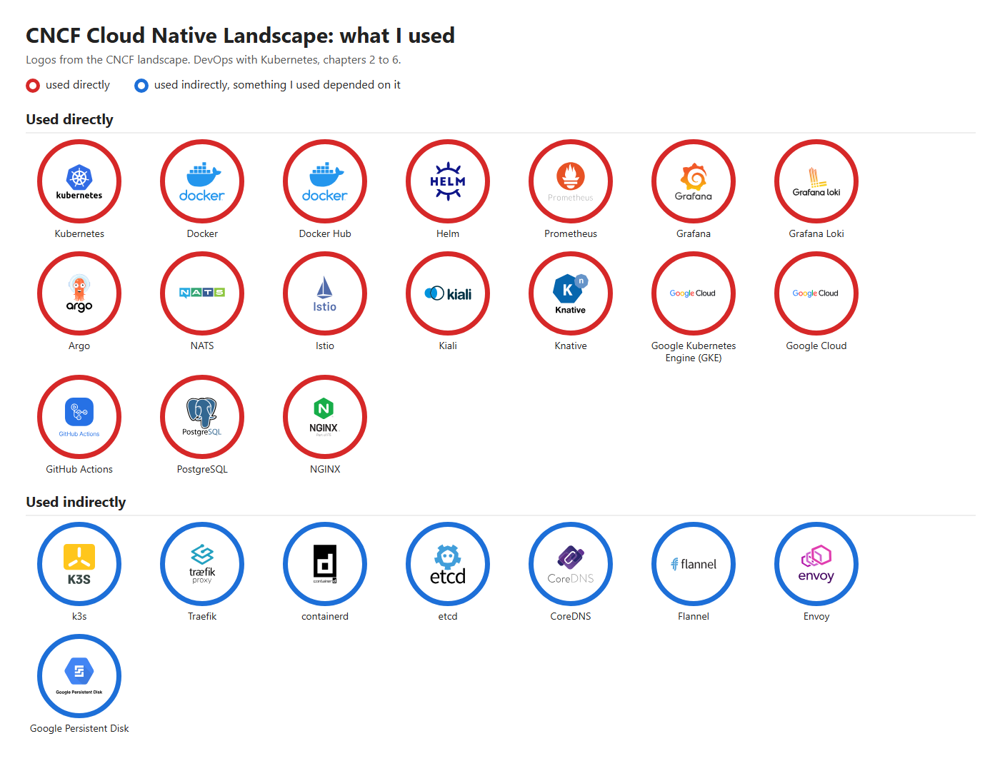

# CNCF Cloud Native Landscape

Exercise 5.8. The picture is made from the logos of the [CNCF landscape](https://landscape.cncf.io/) for the projects I used, and it is not a copy of the whole landscape image with circles on it. A **red** circle marks a project I used directly, and a **blue** circle marks one that something I used depended on.

## Used directly

| Project | Where I used it |
|---|---|
| Kubernetes | In every exercise, on k3d in the first chapters and on GKE from chapter 4 |
| Docker | Building and running the images of every app with Dockerfiles, with Docker Desktop |
| Docker Hub | Pushing the images of the exercises (chapters 2 to 4) |
| Helm | Installing Prometheus, Loki and Grafana in 2.10, Prometheus in 4.3 and 5.2, and NATS in 4.6 |
| Prometheus | Monitoring in 2.10, the query in 4.3, the canary analysis in 4.4 and the metrics for Kiali in 5.2 |
| Grafana | Looking at the logs in 2.10 |
| Grafana Loki | Storing the logs in 2.10 |
| Argo | Argo Rollouts for the canary release in 4.4 and Argo CD for GitOps in 4.7 to 4.10 |
| NATS | The messages between the backend and the broadcaster in 4.6 |
| Istio | The ambient mesh in 5.2 and 5.3 |
| Kiali | Seeing the mesh traffic and the 75/25 split in 5.2 and 5.3 |
| Knative | Serverless in 5.6 and ping-pong in 5.7 |
| Google Kubernetes Engine (GKE) | The cluster from chapter 4 on |
| Google Cloud | Around GKE: Artifact Registry, Cloud Storage for the backups, Cloud Logging, IAM and Workload Identity |
| GitHub Actions | The pipelines of 3.6 to 4.10 |
| PostgreSQL | The databases of ping-pong and of the project |
| NGINX | Serving the copied site in 5.1 and the Wikipedia pages in 5.4 |

## Used indirectly

| Project | How something I used depended on it |
|---|---|
| k3s | k3d runs k3s, so it was the local cluster of the first chapters |
| Traefik | k3s comes with it, and it served the Ingress resources of the first chapters |
| containerd | The container runtime of k3s and of the GKE nodes |
| etcd | Kubernetes keeps all its cluster data in it |
| CoreDNS | The cluster DNS behind the service names like `todo-backend-svc` |
| Flannel | The network plugin that k3s uses inside k3d |
| Envoy | Inside the Istio waypoint in 5.3 and the Kourier gateway in 5.6 |
| Google Persistent Disk | The disks that GKE creates for the volume claims |

## Used but not in the landscape data

Kustomize (3.5 onwards), the Gateway API (3.3 onwards), k3d (first chapters), Kourier (5.6) and Grafana Alloy (2.10).

## Outside of the course

This list only covers the course, so anything I used outside of it is not included.
